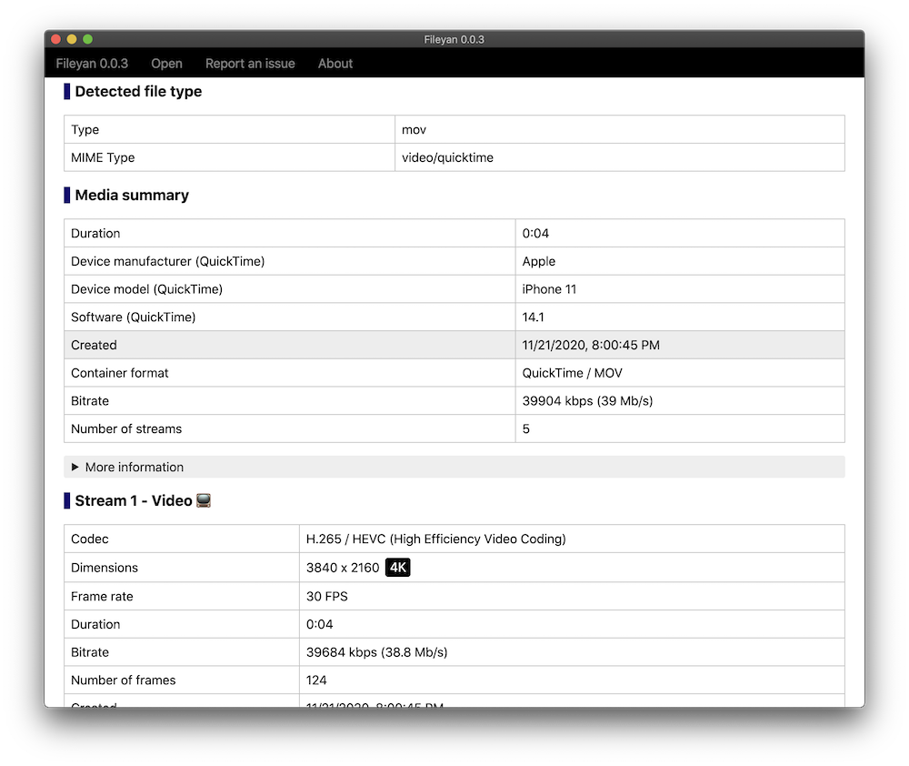

# Fileyan Releases

	

Fileyan is an app to view technical information of media and other files. MediaInfo GUI alternative.

[Download latest Windows installer](https://coldfunction.com/dds/mgenware/fileyan/Fileyan%20Setup%200.0.2.exe)

[Download latest macOS installer](https://coldfunction.com/dds/mgenware/fileyan/Fileyan-0.0.1.dmg)

## Screenshots

Fileyan viewing a video shot by iPhone:

## Changelog

[Changelog](https://github.com/mgenware/fileyan-issues/milestones?state=closed)
